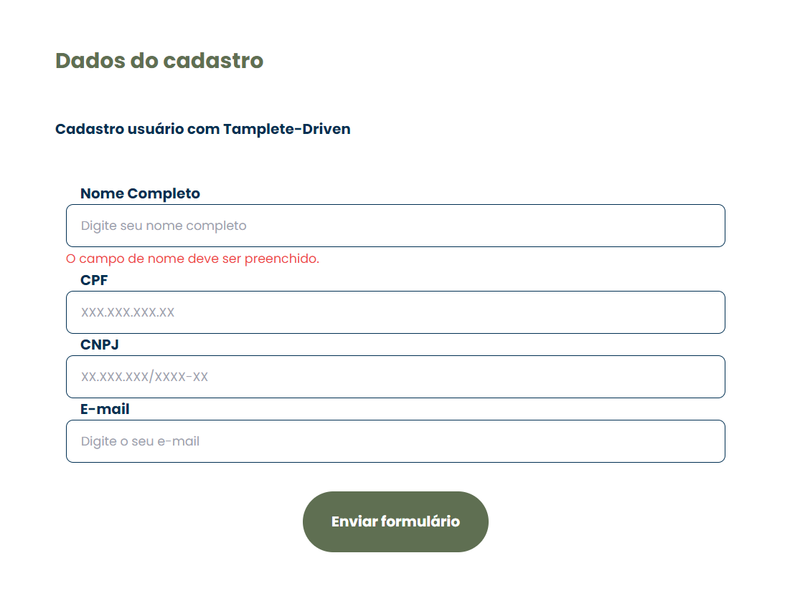
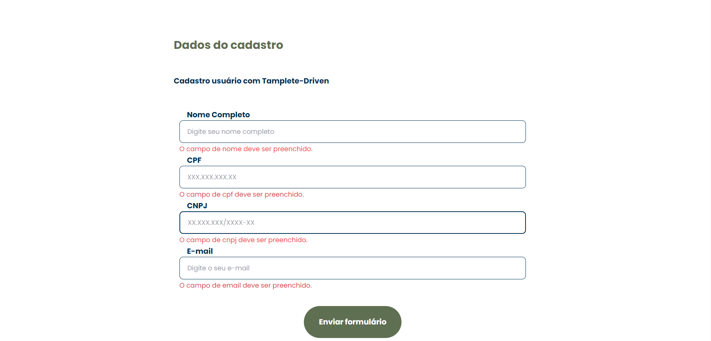
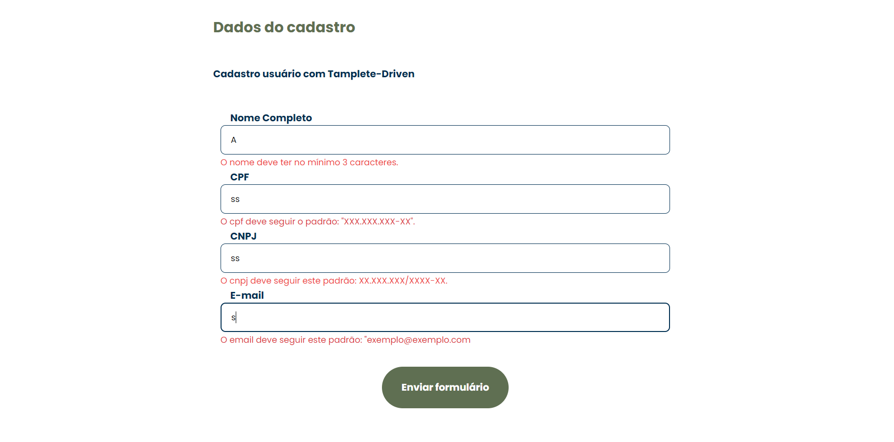
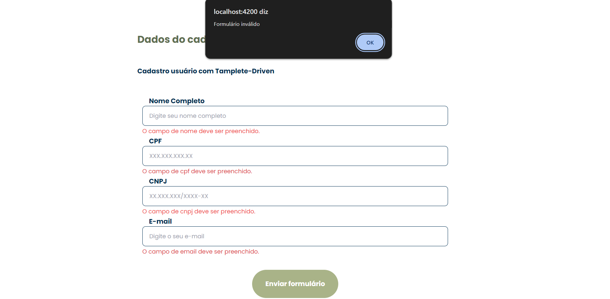
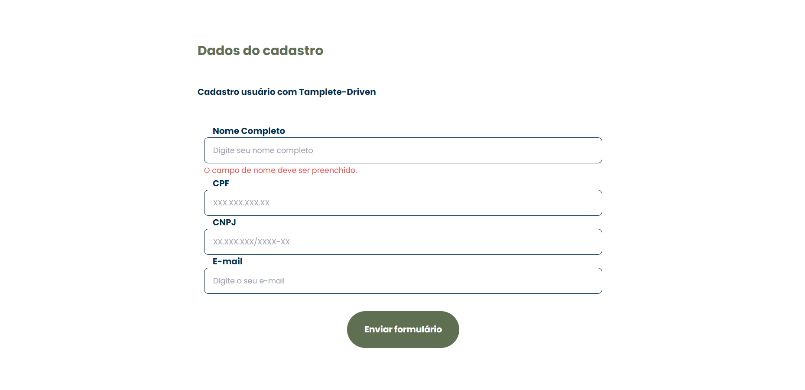

# Projeto de Formulários com Angular e Tailwind CSS

This project was generated with [Angular CLI](https://github.com/angular/angular-cli) version 13.2.5.

Este projeto é uma aplicação web desenvolvida em Angular que apresenta dois tipos de formulários: um utilizando **Template-Driven Forms** e outro com **React Forms**. A aplicação é estilizada com **Tailwind CSS**, proporcionando uma aparência moderna e responsiva.

## Funcionalidades

- **Template-Driven Form**: Um formulário que utiliza a abordagem Template-Driven do Angular, facilitando a captura e validação de dados diretamente no template.
- **React Form**: Um formulário dinâmico que utiliza a biblioteca React Forms para gerenciar a entrada de dados e a validação.
- **Validação**: Ambos os formulários possuem validações para garantir a integridade dos dados.
- **Estilização Responsiva**: Utiliza Tailwind CSS para um design responsivo e adaptável a diferentes tamanhos de tela.

## Tecnologias Utilizadas

- **Angular**: Framework de front-end para construção da aplicação.
- **Tailwind CSS**: Biblioteca de estilos CSS para design moderno e responsivo.
- **React Forms**: Biblioteca para gerenciar formulários de forma eficiente.

## Instalação

### Clone o Repositório

git clone https://github.com/AndressaTurchetto/formulario-angular.git
cd nome-do-repositorio
npm install
ng serve

